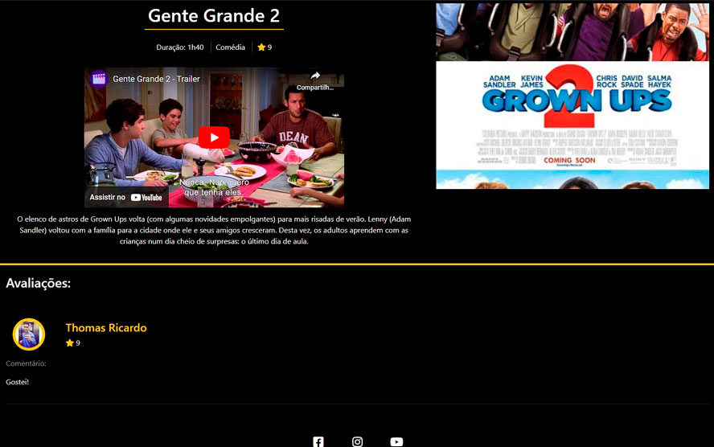
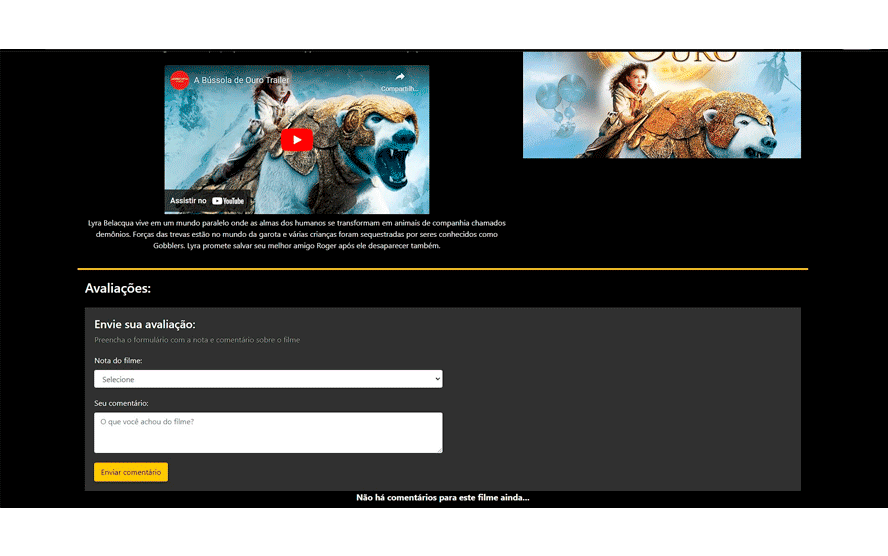

<h1 align="center">MovieStar</h1>

Projeto desenvolvido durante o curso de PHP do Básico ao Avançado.

  <a href="#-tecnologias">Tecnologias</a>&nbsp;&nbsp;&nbsp;|&nbsp;&nbsp;&nbsp;
  <a href="#-projeto">Projeto</a>&nbsp;&nbsp;&nbsp;|&nbsp;&nbsp;&nbsp;
  <a href="#memo-licença">Licença</a>

  

 

  

  

  

  

  

## 🚀 Tecnologias

Esse projeto foi desenvolvido com as seguintes tecnologias:

- HTML e CSS
- PHP
- MYSQL (PDO)
- Criptografia e Tokenização

## 💻 Projeto
O projeto foi desenvolvido para que usuários consiga olhar diversos filmes, junto com seus trailers, além de notas e comentários feitos por outros usuários já cadastrados na API.
Usuários cadastrados podem fazer o cadastro de filmes, comentar sobre eles e dar notas para os mesmos.

## :memo: Licença

Esse projeto está sob a licença MIT.
